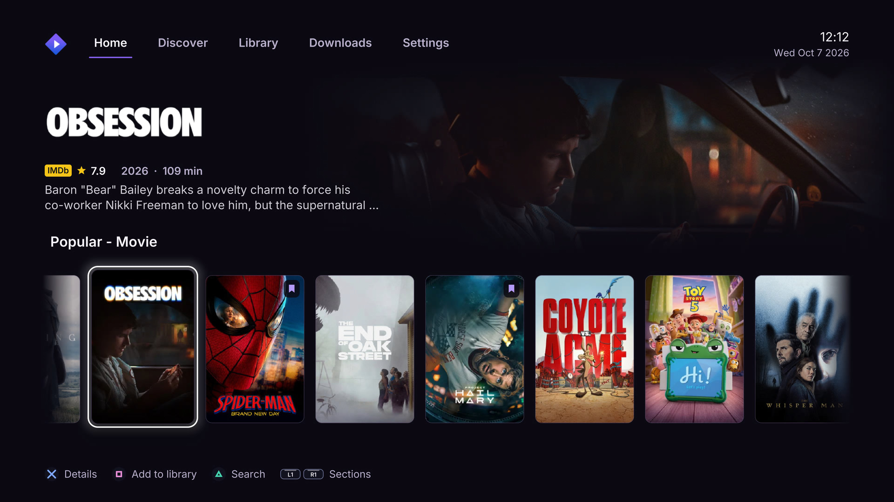

# Stremio Plus

A native Stremio app for PlayStation 5, built around the way you watch on a TV.
Browse your catalogs, pick a stream, save something for later, and keep your
library together in an interface designed for the DualSense.



## Made for PS5

**Built with Prospero UI.** Stremio Plus uses BlackBearReloaded's
[ps5-homebrew-ui](https://github.com/blackbearreloaded/ps5-homebrew-ui) to bring
fluid carousels, large artwork, smooth transitions, and translucent playback
controls to a native C++ interface. Films get room for their artwork; series
get a dedicated season selector and episode thumbnails.

**Your Stremio add-ons, including Torrentio.** Sign in with your Stremio
account to bring over your installed add-ons and library. Torrentio sources
appear alongside compatible providers, with quality, language, file size, and
seeder information when the add-on supplies it. Direct links and torrents
play on the console using its built-in playback and torrent support, without
a separate Stremio streaming server to configure.

**A dedicated torrent engine and offline downloads.** Stremio Plus has its
own native torrent engine, designed for high-throughput transfers directly
to the PS5. Download the selected movie or episode while you keep browsing,
then play it offline from the Downloads tab. Each transfer shows its progress,
speed, estimated time remaining, and connected peers and seeders. The queue
supports pause, resume, and deletion. Actual speed depends on the swarm,
connection, and storage; download performance is under active development.

**Playback that fits your setup.** The app follows the PS5's output resolution,
with 1080p, 1440p, and 4K options. It combines BlackBearReloaded's OpenGL and
native app libraries with FFmpeg and PS5 hardware decoding for supported
H.264, HEVC, HEVC Main10, and VP9 streams. Other formats use the available
FFmpeg decoders. Compatibility depends on the stream's profile and container;
the current output is SDR, with HDR10 sources tone-mapped for display.

**Artwork that reaches your controller.** As you highlight a movie or series,
the DualSense light bar picks up a dominant color from its poster and eases
into the new shade. That color stays with you through loading and playback.
You can turn the effect off in Settings.

**Subtitles your way.** Choose a font, size, color, background opacity, and
effects such as an outline, shadow, or embossing. A live preview shows each
change before you return to the video. Audio and subtitle language preferences
are available separately.

**Quick add-on sync.** Your account's add-on collection loads in the background,
bringing existing configurations across without entering provider URLs on
the console. Install or configure add-ons in Stremio on your phone or computer,
then sync them in Stremio Plus.

## Screenshots

| Stream selection | Library |
| --- | --- |
|  |  |

| Discover | Subtitle customization |
| --- | --- |
|  |  |


## Getting started

You need a PS5 with a working native homebrew loader, a Stremio account, and
the add-ons you want to use configured on that account. Build instructions
are in [BUILDING.md](BUILDING.md). The application's title ID is `PPSA74126`.

Before using downloads, create **`/data/Stremio`** on the console and set its
directory permissions to **`0777`** with your file manager or FTP client.
From a console shell, the equivalent is:

```sh
mkdir -p /data/Stremio
chmod 0777 /data/Stremio
```

The homebrew environment must allow the app to access that directory and
provide a local ELF loader on port `9021`. The app uses that loader for its
filesystem grant and automatically starts a PS5 download writer when a
torrent download begins. Videos are stored in `/data/Stremio/downloads/`;
keep enough free space for the files you select.

On first launch, scan the sign-in QR code or open the displayed link on
another device. Once connected, Stremio Plus opens your home screen. The
interface follows the console language where supported, with English as the
fallback. English and Italian are currently available, and you can choose
either in Settings. Signing out returns to the sign-in screen.

## Controls

| Button | Action |
| --- | --- |
| D-pad | Move through items and controls |
| Cross | Open the selected item or confirm |
| Circle | Go back; hide visible playback controls before leaving the video |
| Triangle | Open search while browsing |
| L1 / R1 | Change top-level tabs, seasons, or stream providers, depending on the screen |
| Square on a cover | Add or remove it from your library |
| Square in Continue Watching | Remove that item from Continue Watching |
| Square on a stream | Download **only the selected stream** |
| Up / Down during playback | Show playback controls |
| Options during playback | Open audio and subtitle controls |

Playback skip intervals for the D-pad and L1 / R1 can be set independently.
Completed downloads offer a choice between starting again and resuming from
the saved position for that movie or episode.

## Downloads and recovery

Torrent downloads use a dedicated writer process on the PS5, started
automatically through the homebrew environment's ELF loader. This moves bulk
file writes out of the native application's throttled storage context,
following the approach documented by
[ProsperoStore](https://github.com/blackbearreloaded/ProsperoStore).
The app keeps the torrent engine, queue, and playback controls; no external
computer or streaming server is involved.

The writer accepts one sequential, page-aligned block of up to 4 MiB at a
time. Progress advances only after the writer confirms the complete block.
The torrent engine continues receiving and verifying pieces within its
memory budget. Only the active download transfers media; queued titles wait
for their turn.

Progress is saved durably after 256 MiB or 30 seconds of new torrent data,
whichever comes first. Pausing, stopping the app normally, or finishing a
download also saves the current position. If the console loses power or the
app crashes, the next attempt resumes from the last durable checkpoint and
downloads any uncommitted tail again. A partially written file is never
marked complete. If the writer cannot start or its connection is interrupted,
the app reports an error and retains the recoverable partial download.

## Troubleshooting

Logs are kept together in `/data/Stremio/`. For a bug report, include the app
version, the steps that triggered it, and these files:

- `boot-current.txt`
- `log.txt`
- `runtime.json`
- `crash-current.txt`, if a crash occurred

For download problems, include when the slowdown started and whether a video
was playing at the time. Checkpoint failures record the operation that failed
and its system error code. The downloaded media files are not needed.

## Credits and license

Stremio Plus is developed by [LoZazaMastro](https://github.com/LoZazaMastro)
and builds on [Sp9nky's unofficial Stremio PS5 port](https://github.com/Sp9nky/unofficial-stremio-ps5-port).
Special thanks to [BlackBearReloaded](https://github.com/blackbearreloaded)
for the UI kit, OpenGL implementation, native app tooling, and ProsperoStore's
work on PS5 file-worker performance; to
[ps5-payload-dev](https://github.com/ps5-payload-dev) for the public SDK and
library ports; and to [Stremio](https://github.com/Stremio) and the other
open-source projects that make this app possible.

The project is licensed under the [GNU GPL v3](LICENSE). Dependency licenses
and attribution are listed in [THIRD_PARTY.md](THIRD_PARTY.md).

Stremio Plus is an independent homebrew project, unaffiliated with Stremio
or Sony Interactive Entertainment. Their names, logos, and other trademarks
belong to their respective owners.
