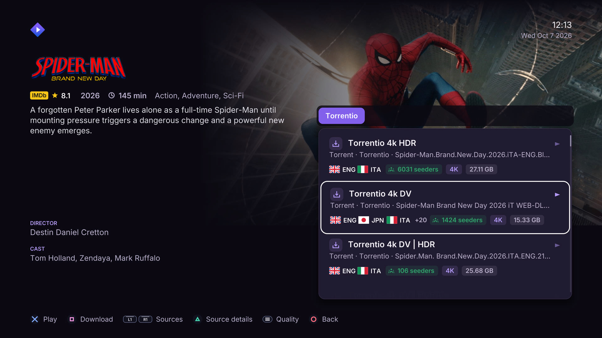
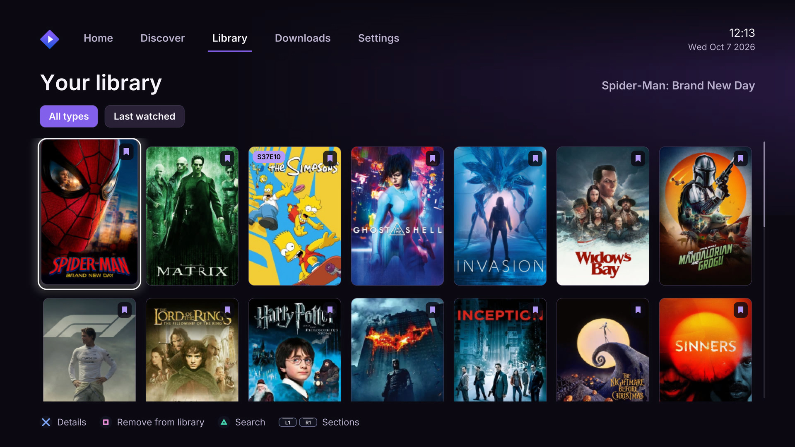
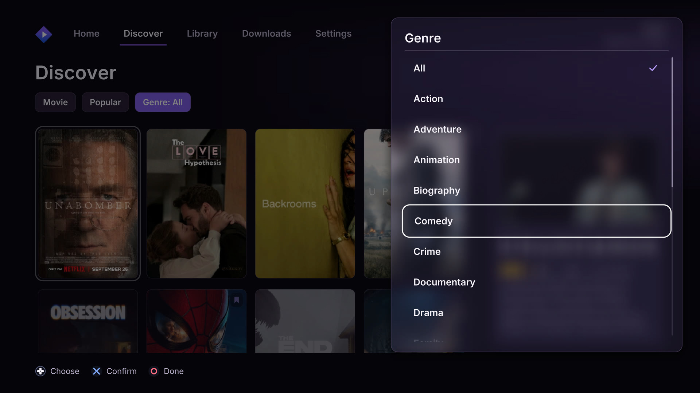
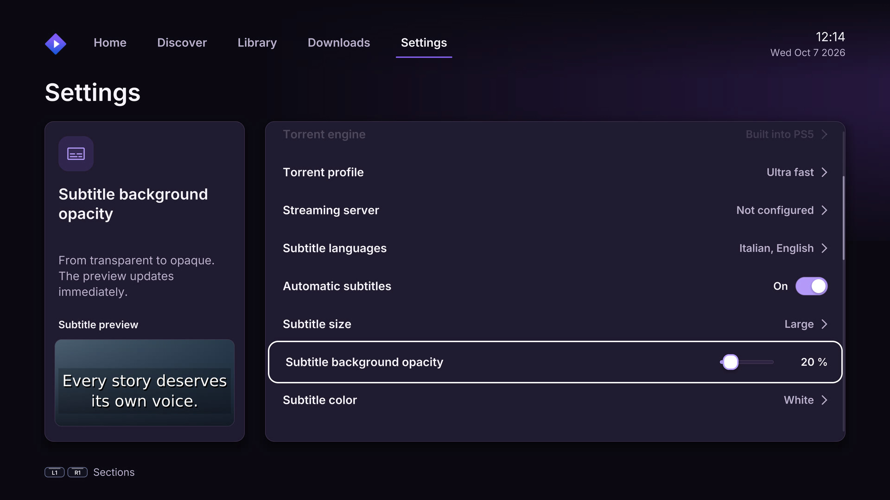
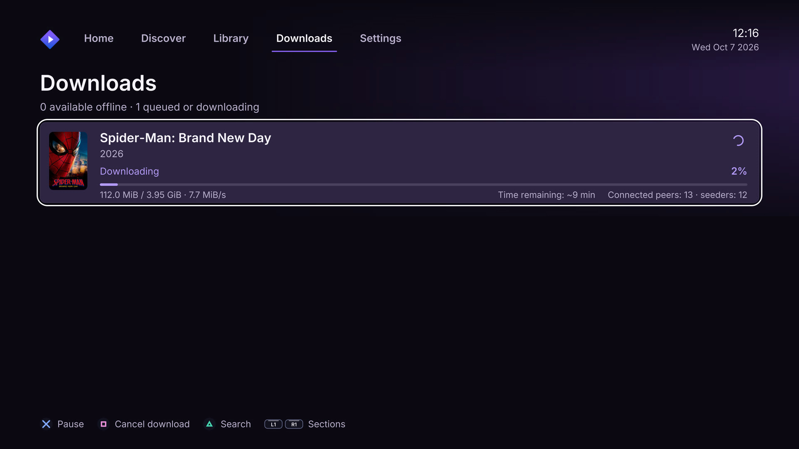

# RBTV+ for PS5 — RB-Plus

**Status: integration work in progress.** This repository is the working home for the RBTV+ port, using the native PS5 application and TV interface derived from Stremio Plus as the base.

The target is the original RBTV+ catalogue, event/match details, and stream-resolution flow—not fabricated match fixtures. The Stremio Plus codebase supplies native PS5 rendering, D-pad navigation, the media player, and packaging infrastructure; Stremio-specific account/catalog behavior still needs to be adapted for RBTV+.

## Current implementation boundaries

- `RBTV_PS5_Port_v0.3.0.zip` is retained as the earlier Windows-hosted web/API prototype for reference. It is **not** integrated into the native C++ executable.
- The native app currently starts with its existing Stremio account/add-on flow. RBTV+ API endpoints and match data have not yet been connected to the native UI.
- RBTV+ API endpoint domains found in the APK must be reviewed before the first live request. Do not treat endpoint reachability or ownership as verified.
- The prototype supports standard HTTP(S) HLS/header relay where possible. RBTV+'s Android stream middleware (including P2P/CSL and provider-specific resolution) has not been ported yet, so some sources may not play.
- This is not yet a released or console-validated RBTV+ PKG.

## Working workflow

Clone once, then update the local checkout after GitHub changes:

```powershell
git clone https://github.com/omaryazghi98-code/RB-Plus.git
cd RB-Plus
git pull
```

On subsequent updates, run `git pull` from the repository folder. If you already have a clone, there is no need to download ZIPs.

## Native PS5 build

The inherited native build instructions are in [BUILDING.md](BUILDING.md). The current build metadata and title identity are still Stremio Plus-specific until the RBTV+ integration and packaging transition are completed. Do not install an artifact built from the current source expecting an RBTV+ native port.

## Reference prototype

The earlier web/API prototype is archived at [RBTV_PS5_Port_v0.3.0.zip](RBTV_PS5_Port_v0.3.0.zip). Keep this as a reference while the native implementation is developed; it is not the final architecture.

---

## Original Stremio Plus project information

The sections below are retained as a historical reference for the inherited native codebase and its dependencies. They are not a claim that RBTV+ currently connects to Stremio or that the RBTV+ port is finished.

## Made for PS5

**Built with Prospero UI.** Stremio Plus uses BlackBearReloaded's
[ps5-homebrew-ui](https://github.com/blackbearreloaded/ps5-homebrew-ui) to bring
fluid carousels, large artwork, smooth transitions, and translucent playback
controls to a native C++ interface. Films get room for their artwork; series
get a dedicated season selector and episode thumbnails.

**Your Stremio add-ons, including Torrentio.** Sign in with your Stremio
account to bring over your installed add-ons and library. Torrentio sources
appear alongside compatible providers, with quality, language, file size, and
seeder information when the add-on supplies it. Direct links and torrents
play on the console using its built-in playback and torrent support, without
a separate Stremio streaming server to configure.

**A dedicated torrent engine and offline downloads.** Stremio Plus has its
own native torrent engine, designed for high-throughput transfers directly
to the PS5. Download the selected movie or episode while you keep browsing,
then play it offline from the Downloads tab. Each transfer shows its progress,
speed, estimated time remaining, and connected peers and seeders. The queue
supports pause, resume, and deletion. Actual speed depends on the swarm,
connection, and storage; download performance is under active development.
Choose a download folder in Settings, including a mounted M.2 or external
volume, and create a **Stremio Plus Downloads** folder directly from the picker.
Changing that folder moves your existing downloads to the new destination.

**Playback that fits your setup.** The app follows the PS5's output resolution,
with 1080p, 1440p, and 4K options. It combines BlackBearReloaded's OpenGL and
native app libraries with FFmpeg and PS5 hardware decoding for supported
H.264, HEVC, HEVC Main10, and VP9 streams. Other formats use the available
FFmpeg decoders. Compatibility depends on the stream's profile and container;
the current output is SDR, with HDR10 sources tone-mapped for display.

**Artwork that reaches your controller.** As you highlight a movie or series,
the DualSense light bar picks up a dominant color from its poster and eases
into the new shade. That color stays with you through loading and playback.
You can turn the effect off in Settings.

**Subtitles your way.** Choose a font, size, color, background opacity, and
effects such as an outline, shadow, or embossing. A live preview shows each
change before you return to the video. Audio and subtitle language preferences
are available separately.

**Quick add-on sync.** Your account's add-on collection loads in the background,
bringing existing configurations across without entering provider URLs on
the console. Install or configure add-ons in Stremio on your phone or computer,
then sync them in Stremio Plus.

## Screenshots

| Stream selection | Library |
| --- | --- |
|  |  |

| Discover | Subtitle customization |
| --- | --- |
|  |  |



## Getting started

You need a PS5 with a working native homebrew loader, a Stremio account, and
the add-ons you want to use configured on that account. Build instructions
are in [BUILDING.md](BUILDING.md). The application's title ID is `PPSA74126`.

App settings, the download directory registry, and streaming caches live in
**`/data/Stremio/appdata`**. Logs stay in **`/data/Stremio`**. The app prepares
these directories on launch. If your homebrew environment cannot create or
access the parent directory, create **`/data/Stremio`** and set its directory
permissions to **`0777`** with your file manager or FTP client. From a console
shell, the equivalent is:

```sh
mkdir -p /data/Stremio
chmod 0777 /data/Stremio
```

The homebrew environment must allow the app to access that directory and
provide a local ELF loader on port `9021`. The app uses that loader for its
filesystem grant and automatically starts a PS5 download writer when a
torrent download begins. Choose a video destination with the folder picker
in Settings before starting a new download. If no folder has been selected,
the download action shows a reminder with an OK button. Existing downloads
in `/data/Stremio/downloads/` are discovered and included when moving to your
chosen folder. Keep enough free space on the destination filesystem.

Installing the app itself on an M.2 volume, for example at
`/mnt/ext1/homebrew/PPSA74126`, does not change the settings or log paths.
To store videos on that volume, select a folder under `/mnt/ext1` in the
download folder picker.

On first launch, scan the sign-in QR code or open the displayed link on
another device. Once connected, Stremio Plus opens your home screen. The
interface follows the console language where supported, with English as the
fallback. English and Italian are currently available, and you can choose
either in Settings. Signing out returns to the sign-in screen.

## Controls

| Button | Action |
| --- | --- |
| D-pad | Move through items and controls |
| Cross | Open the selected item or confirm |
| Circle | Go back; hide visible playback controls before leaving the video |
| Triangle | Open search while browsing |
| L1 / R1 | Change top-level tabs, seasons, or stream providers, depending on the screen |
| Square on a cover | Add or remove it from your library |
| Square in Continue Watching | Remove that item from Continue Watching |
| Square on a stream | Download **only the selected stream** |
| Up / Down during playback | Show playback controls |
| Options during playback | Open audio and subtitle controls |

Playback skip intervals for the D-pad and L1 / R1 can be set independently.
Completed downloads offer a choice between starting again and resuming from
the saved position for that movie or episode.

When a series episode ends, an optional card shows the next episode's
thumbnail, title, and number. Its countdown defaults to 15 seconds. Choose
**Watch now** to continue immediately or **Ignore** to dismiss it; Circle
also dismisses it. If the countdown reaches zero, the next episode starts
automatically. Autoplay and the countdown duration can be changed in Settings.

## Downloads and recovery

### Choosing a folder

Open the download folder setting to browse accessible directories, including
mounted volumes under `/mnt`. Use the D-pad to move and Cross to enter a
folder. Left, or the `..` entry, goes to its parent; Circle closes the picker.
Triangle selects the folder currently
displayed. Square creates **Stremio Plus Downloads** in that folder and opens
it; press Triangle to select it. Options refreshes the directory listing.

Choosing a different folder moves all existing downloads there, including
completed videos, partial downloads, saved artwork, and queued items. The
queue is suspended while the move runs, and the picker shows its progress.
After a successful move, the files are removed from their old locations and
downloads continue from the new folder. Unrelated files in either folder are
left alone.

Moving between volumes requires enough free space at the destination. The
original files are kept until their transferred data is verified and saved;
the app does not leave a second copy after a successful move. If a drive is
disconnected or a write fails, the app reports the problem and preserves the
saved state needed to recover the move. Reconnect any source drive before
changing the destination. A directory must pass a write check before use.
For an interrupted move, reopen the download folder setting: the picker
returns to the pending destination. Confirm it again to continue. New
downloads and file deletion wait until that move has finished.
The app applies permissions `0777` to the selected folder, reads the mode
back, and performs a real write check before accepting it. Creating
**Stremio Plus Downloads** applies and checks the same permissions. These
changes apply only to those folders; the picker does not recursively change
permissions on other files or directories.

### Transfers and saved state

Torrent downloads use a dedicated writer process on the PS5, started
automatically through the homebrew environment's ELF loader. This moves bulk
file writes out of the native application's throttled storage context,
following the approach documented by
[ProsperoStore](https://github.com/blackbearreloaded/ProsperoStore).
The app keeps the torrent engine, queue, and playback controls; no external
computer or streaming server is involved.

The writer accepts one sequential, page-aligned block of up to 4 MiB at a
time. Progress advances only after the writer confirms the complete block.
The torrent engine continues receiving and verifying pieces within its
memory budget. Only the active download transfers media; queued titles wait
for their turn.

Progress is saved durably after 256 MiB or 30 seconds of new torrent data,
whichever comes first. Pausing, stopping the app normally, or finishing a
download also saves the current position. If the console loses power or the
app crashes, the next attempt resumes from the last durable checkpoint and
downloads any uncommitted tail again. A partially written file is never
marked complete. If the writer cannot start or its connection is interrupted,
the app reports an error and retains the recoverable partial download.

For downloads with a known file size, the app checks space on the destination
filesystem before starting or resuming. The check uses the remaining bytes,
plus a small allowance for saved state. If storage runs out during a transfer,
the last valid checkpoint is kept and queued transfers wait until you free
space and retry. Other apps can consume space after the check, so write errors
are still handled throughout the transfer.

Existing downloads remain listed whenever their folder can be read, even if
the app cannot write to it. Startup checks the saved inventory and its recovery
copies. If a download's information is missing or damaged, its files appear
as an **Unrecognized download**, with the storage they occupy when measurable.
These files are not played or restarted using guessed metadata. Press Square
to delete the selected download and its files; deletion can free space even
when there is no room to save new queue state. No existing download is deleted
automatically just because its information could not be read.

Selecting a new destination changes that destination folder to `0777`.
It does not recursively apply that mode to downloads or other files. New
job directories and files containing source configuration use private
permissions, including when they are transferred to a different volume.

### Installation storage

The native manifest sets `downloadDataSize` to `0`. Stremio Plus does not
reserve a private `/download0` volume on installation. Streaming caches grow
as received data is written, within their existing capacity limits; their
maximum capacity is not preallocated. Downloaded media occupies space only
on its selected destination filesystem.

Versions up to 0.5.5 requested a 16 GiB private volume. Replacing application
files may leave that volume registered by the loader. To reclaim an existing
reservation, close the app, uninstall the registered title using the normal
console or loader uninstall operation, then install the current build.
Simply deleting or replacing files through FTP may leave the registration.
Keep `/data/Stremio` and your video directories. Do not manually modify a
mounted private volume. An uninstall can remove account settings from the
old private volume, so you may need to sign in again.

## Troubleshooting

Logs are kept together in `/data/Stremio/`. For a bug report, include the app
version, the steps that triggered it, and these files:

- `boot-current.txt`
- `log.txt`
- `runtime.json`
- `crash-current.txt`, if a crash occurred

For download problems, include when the slowdown started and whether a video
was playing at the time. Checkpoint failures record the operation that failed
and its system error code. Storage errors also record the measured capacity
of the destination filesystem when available. Startup logs show directory
permissions before and after filesystem access is established. The downloaded
media files are not needed.

## Credits and license

Stremio Plus is developed by [LoZazaMastro](https://github.com/LoZazaMastro)
and builds on [Sp9nky's unofficial Stremio PS5 port](https://github.com/Sp9nky/unofficial-stremio-ps5-port).
Special thanks to [BlackBearReloaded](https://github.com/blackbearreloaded)
for the UI kit, OpenGL implementation, native app tooling, and ProsperoStore's
work on PS5 file-worker performance; to
[ps5-payload-dev](https://github.com/ps5-payload-dev) for the public SDK and
library ports; and to [Stremio](https://github.com/Stremio) and the other
open-source projects that make this app possible.

The project is licensed under the [GNU GPL v3](LICENSE). Dependency licenses
and attribution are listed in [THIRD_PARTY.md](THIRD_PARTY.md).

Stremio Plus is an independent homebrew project, unaffiliated with Stremio
or Sony Interactive Entertainment. Their names, logos, and other trademarks
belong to their respective owners.


## RB-Plus maintenance note

Before release, update this document, the title metadata under `app/sce_sys/param.json`, `CMakeLists.txt`, screenshots and credits to match the final RBTV+ application. Keep upstream attribution and applicable GPL notices intact.
